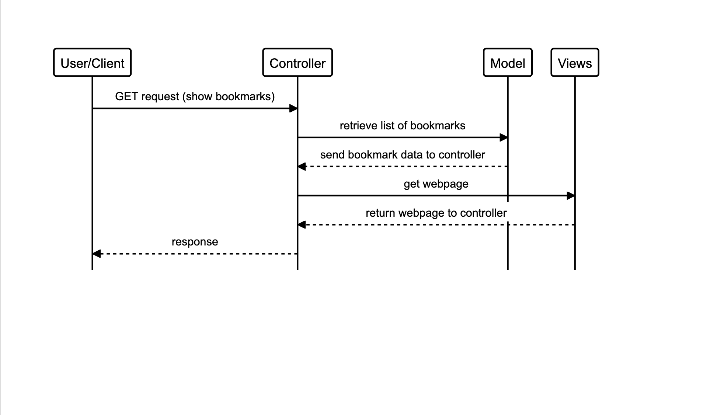

# bookmark_manager

## Specification

* Show a list of bookmarks
* Add new bookmarks
* Delete bookmarks
* Update bookmarks
* Comment on bookmarks
* Tag bookmarks into categories
* Filter bookmarks by tag
* Users are restricted to manage only their own bookmarks

## User Stories

> As a user
>
> So that I can see my saved webpages
>
> I want to be able to open a list of bookmarks

> As a user
>
> So I can store bookmark data for later retrieval
>
> I want to add a bookmark to Bookmark Manager

## Diagrams

### Sequence Diagram

```
alias u = "User/Client"
alias c = "Controller"
alias m = "Model"
alias v = "Views"

u->c: "GET request (show bookmarks)"
c->m: "retrieve list of bookmarks"
m-->c: "send bookmark data to controller"
c->v: "get webpage"
v-->c: "return webpage to controller"
c-->u: "response"
```



## Database

To set up the database, follow the steps below:

1. Connect to psql
2. Create the database using the psql command CREATE DATABASE bookmark_manager;
3. Connect to the database using the pqsl command \c bookmark_manager;
4. Run the query in db/migrations/01_create_bookmarks_table.sql
5. Run the query in db/migrations/02_add_title_to_bookmarks.sql

To set up the test database, follow the steps below:

1. Connect to psql
2. Create the database using the psql command CREATE DATABASE bookmark_manager_test;
3. Connect to the database using the pqsl command \c bookmark_manager_test;
4. Run the query we have saved in the file 01_create_bookmarks_table.sql
5. Run the query in db/migrations/02_add_title_to_bookmarks.sql
